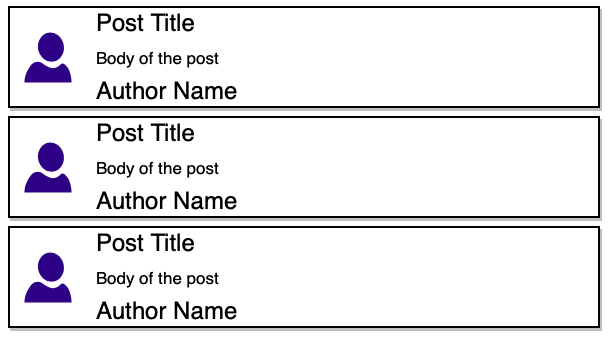

# About 

Build a fake blog using react, I followed the Udemy course for complete this application as a lesson.

## Goals

Understand the purpose of reducers.

Understand making API requests with Redux.

Learning redux and react thunk

## Dependencies

* redux
* redux thunk
* lodash
* axios

## API

The API used for hold fake data on my blog app.
[JSON Placeholder API]("https://jsonplaceholder.typicode.com/")

## Markup
